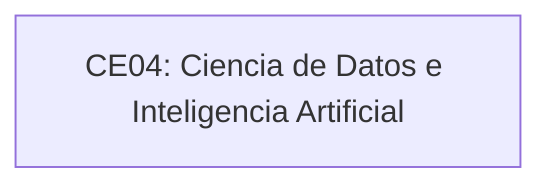

# Línea de Ciencia de Datos e IA

## CE04: Ciencia de Datos e Inteligencia Artificial

Diseña y gestiona sistemas inteligentes basándose en metodologías, estándares y herramientas a fin de lograr estrategias de mejora para la organización.

## Estado de la línea

La estructura interna de esta línea se encuentra en versión preliminar para uso operativo. La fuente oficial disponible presenta la competencia de línea CE04, pero no detalla competencias específicas en el archivo base de competencias.

## Enfoque de construcción esperado

Esta línea organizará lo que el estudiante debe construir para demostrar gestión de datos analíticos, modelos de aprendizaje automático, inteligencia artificial, visualización, experimentación y soluciones basadas en datos.

## Cierre de la línea

El cierre de esta línea debe verificarse mediante una evidencia final integradora basada en datos: modelo, análisis, sistema inteligente, tablero, experimento o solución de IA que demuestre valor organizacional, trazabilidad metodológica y sustentación técnica.

## Vista estructural preliminar

