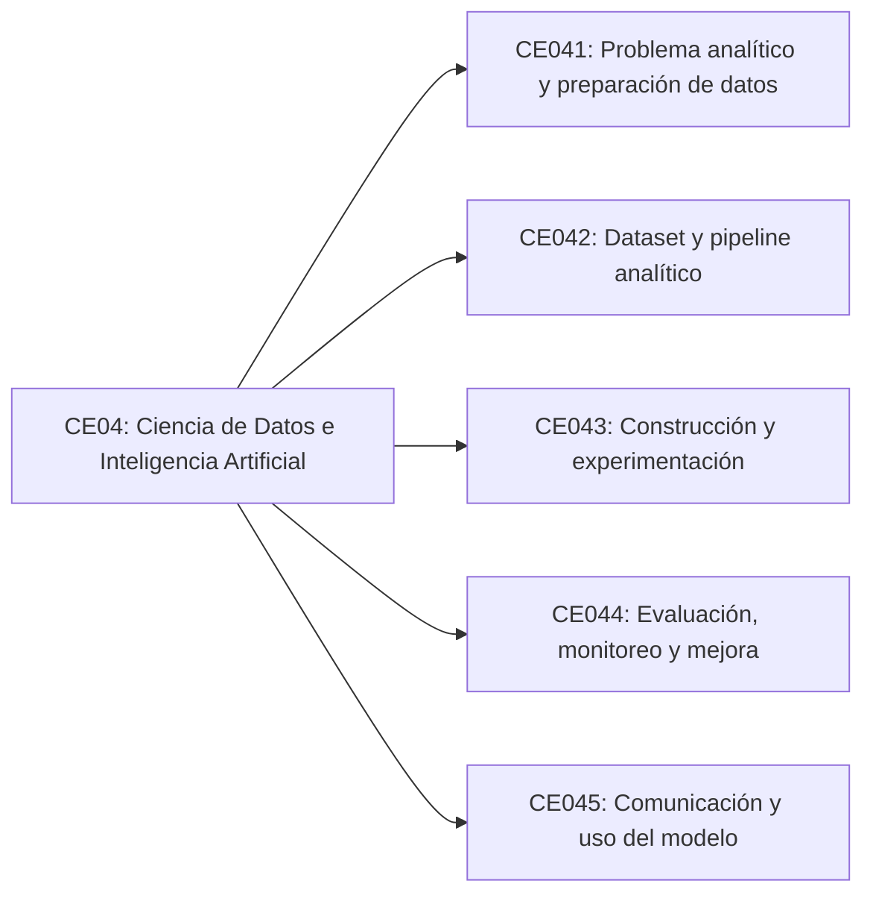

# Línea de Ciencia de Datos e IA

## CE04: Ciencia de Datos e Inteligencia Artificial

Diseña y gestiona sistemas inteligentes basándose en metodologías, estándares y herramientas a fin de lograr estrategias de mejora para la organización.

## Estado de la línea

La estructura interna de esta línea se encuentra en versión preliminar para uso operativo. La fuente oficial disponible presenta la competencia de línea CE04, pero no detalla competencias específicas en el archivo base de competencias. Por ello, el mapa de evidencias se infiere a partir de las evidencias y productos disponibles en los documentos operativos.

## Enfoque de construcción esperado

Esta línea organizará lo que el estudiante debe construir para demostrar gestión de datos analíticos, modelos de aprendizaje automático, inteligencia artificial, visualización, experimentación y soluciones basadas en datos.

## Mapa preliminar de evidencias

Las evidencias de la línea permiten comprobar que el estudiante puede formular un problema analítico, preparar datos, construir modelos, evaluarlos y comunicar resultados útiles para la organización. El detalle se desarrolla en [Evidencias integradoras](evidencias.md).

| Bloque preliminar | Foco de evidencia | Cantidad |
| --- | --- | ---: |
| CE041: Problema analítico y preparación de datos | Problema, fuentes, dataset inicial, variables e hipótesis. | 4 |
| CE042: Diseño de dataset y pipeline analítico | Diseño del dataset, feature engineering, pipeline y estrategia analítica. | 4 |
| CE043: Construcción y experimentación | Construcción de dataset, limpieza, entrenamiento y experimentos. | 4 |
| CE044: Evaluación, monitoreo y mejora | Evaluación de modelos, métricas, monitoreo y reentrenamiento. | 4 |
| CE045: Comunicación y uso del modelo | Storytelling, visualización e interpretación de resultados. | 3 |

## Cierre de la línea

El cierre de esta línea debe verificarse mediante una evidencia final integradora basada en datos: modelo, análisis, sistema inteligente, tablero, experimento o solución de IA que demuestre valor organizacional, trazabilidad metodológica y sustentación técnica.

## Vista estructural preliminar

