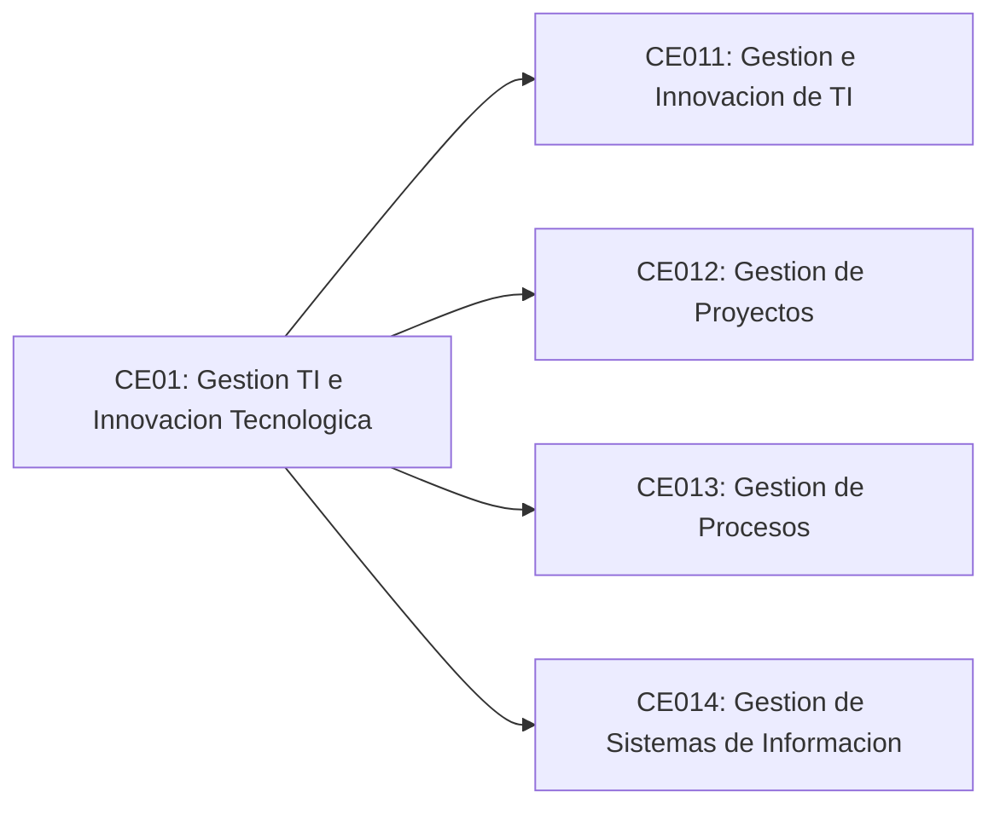

# Linea de Gestion TI

## CE01: Gestion de TI e Innovacion Tecnologica

Disena y gestiona proyectos de tecnologias e informacion basandose en la guia del PMBOK y estandares de calidad a fin de lograr la construccion de resultados y el alcance de objetivos de la organizacion.

## Competencias especificas

### CE011: Gestion e Innovacion de TI

Administra un Plan Estrategico de TI alineado a la estrategia de negocio.

### CE012: Gestion de Proyectos

Aplica los principios de gestion en computacion, las metodologias apropiadas a su campo y la toma de decisiones economicas considerando eventuales riesgos, como individuo y como miembro o lider de equipo, para gestionar proyectos en entornos multidisciplinarios.

### CE013: Gestion de Procesos

Gestiona los procesos de las organizaciones con soluciones TIC.

### CE014: Gestion de Sistemas de Informacion

Apoya la prestacion, el uso y la gestion de sistemas de informacion dentro de un entorno de sistemas de informacion.

## Vista estructural

