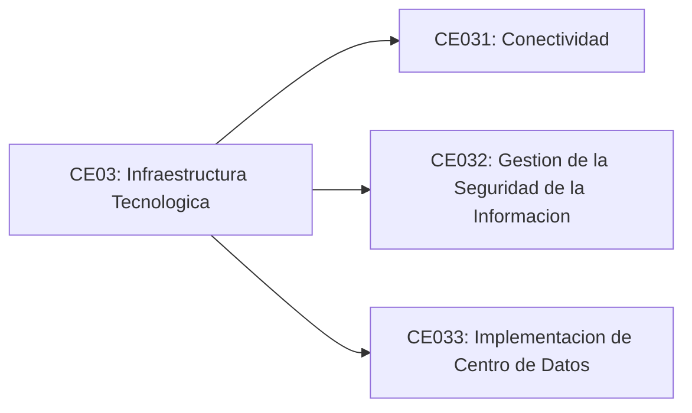

# Linea de Infraestructura

## CE03: Infraestructura Tecnologica

Disena y ejecuta proyectos de infraestructura tecnologica para contribuir en la solucion de problemas de la organizacion siguiendo estandares internacionales y presenta formalmente sus resultados demostrando una actitud etica de la ACM.

## Competencias especificas

### CE031: Conectividad

Disena, implementa y valida infraestructuras de red organizacionales, asegurando segmentacion, disponibilidad, rendimiento y cumplimiento de normas nacionales e internacionales de conectividad, garantizando transferencia segura y eficiente de la informacion.

### CE032: Gestion de la Seguridad de la Informacion

Planifica e implementa controles de seguridad basados en estandares internacionales, asegurando proteccion de activos criticos, gestion de riesgos, continuidad operativa, monitoreo permanente y mejora continua conforme a marcos como ISO 27001 y NIST.

### CE033: Implementacion de Centro de Datos

Disena y despliega servicios de infraestructura y centro de datos, integrando virtualizacion, almacenamiento, alta disponibilidad y monitoreo, garantizando soporte tecnologico confiable para los objetivos estrategicos de la organizacion.

## Vista estructural

