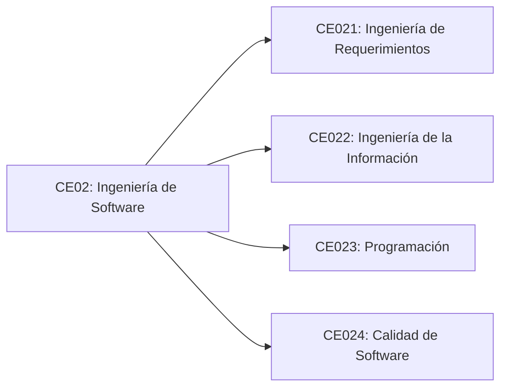

# Línea de Software

## 1. Visión de la línea

La línea de Software forma al estudiante para construir soluciones digitales útiles, confiables, mantenibles y adaptables. Su centro no es aprender lenguajes de programación de manera aislada, sino desarrollar la capacidad de convertir problemas reales en sistemas de software que puedan ser usados, evaluados, corregidos y evolucionados.

En esta línea, el estudiante aprende a pensar como constructor de productos digitales: comprende necesidades, modela procesos, diseña soluciones, programa, prueba, documenta, despliega, mide resultados y mejora continuamente.

Al final de la carrera, el estudiante no debería presentar solo ejercicios académicos. Debería poder mostrar un producto de software funcional, con usuarios o escenarios de uso claros, arquitectura justificable, control de versiones, pruebas, documentación técnica, despliegue y una defensa razonada de las decisiones tomadas.

## 2. Pregunta guía

¿Qué sistema de software puede construir un estudiante de Ingeniería de Sistemas, de manera progresiva, hasta demostrar que está preparado para resolver problemas reales con tecnología?

## 3. Competencias de la línea

La línea de Software corresponde a la competencia CE02 del programa.

### CE02: Ingeniería de Software

Gestiona y desarrolla software de manera eficiente y efectiva, basándose en estándares internacionales de calidad a fin de lograr el control y aseguramiento de la calidad según el contexto de la organización.

Rol asociado: Software Engineer.

La competencia CE02 se despliega en cuatro competencias específicas. La siguiente tabla funciona como mapa de orientación; la definición completa de cada competencia se desarrolla debajo.

| Competencia específica | Aporte en la línea | Rol asociado |
| --- | --- | --- |
| CE021: Ingeniería de Requerimientos | Define y diseña el sistema. | Ingeniero de Requerimientos, Analista Funcional o Arquitecto de Software |
| CE022: Ingeniería de la Información | Gestiona los datos del sistema. | DBA o Ingeniero de Datos orientado a bases de datos |
| CE023: Programación | Construye e integra el software. | Desarrollador Móvil o Desarrollador de Software |
| CE024: Calidad de Software | Asegura y mejora la calidad. | QA Engineer o DevOps Engineer |

### CE021: Ingeniería de Requerimientos

Define y diseña el sistema. Analiza y valida requerimientos funcionales y no funcionales, y diseña la arquitectura del sistema, modelando el comportamiento desde la perspectiva del usuario y del negocio mediante representaciones estructuradas como SRS, prototipos, arquitectura y UML. Asegura trazabilidad, coherencia y alineación con el contexto organizacional y las restricciones del sistema.

Cursos asociados: IR, ADS.

### CE022: Ingeniería de la Información

Gestiona los datos. Modela, diseña, implementa y administra estructuras de datos operacionales, dimensionales y datasets, garantizando integridad, consistencia, rendimiento, seguridad y disponibilidad de la información. Asegura su uso eficiente en el soporte a procesos y toma de decisiones.

Cursos asociados: BD1, BD2.

### CE023: Programación

Construye el software. Desarrolla e integra soluciones de software de escritorio, web, distribuido y móvil, implementando la estructura, componentes y comportamiento del sistema mediante modelos técnicos. Aplica principios de modularidad, desacoplamiento, patrones de diseño y buenas prácticas de desarrollo para lograr soluciones funcionales y mantenibles.

Cursos asociados: FP, POO, LP1, LP2, DIST, MOV.

### CE024: Calidad de Software

Asegura y mejora la calidad. Gestiona y asegura la calidad del producto y del proceso de desarrollo de software mediante pruebas automatizadas, integración y entrega continua, métricas, revisión técnica, gestión de deuda técnica y auditorías. Promueve la mejora continua y la madurez del proceso.

Cursos asociados: IS1, PDS, IS2.

Las evidencias y la evaluación de cierre se presentan en las secciones siguientes como mapa general y se desarrollan en páginas específicas.

## 4. Mapa de evidencias

Las evidencias de la línea permiten comprobar que el estudiante no solo conoce conceptos, sino que produce artefactos técnicos verificables. En esta página se presenta una vista de conjunto; el detalle de cada evidencia, con sus artefactos esperados, se desarrolla en [Evidencias por competencia](evidencias.md).

| Competencia | Foco de evidencia | Cantidad |
| --- | --- | ---: |
| CE021: Ingeniería de Requerimientos | Definición, validación y diseño del sistema. | 4 |
| CE022: Ingeniería de la Información | Modelado, implementación, programación y administración de datos. | 4 |
| CE023: Programación | Construcción de soluciones desktop, web, full-stack, distribuidas o móviles. | 5 |
| CE024: Calidad de Software | Pruebas, CI/CD, aseguramiento técnico, auditoría y evolución. | 4 |

## 5. Construcción progresiva durante la carrera

### Etapa 1: Fundamentos de construcción

En los primeros ciclos, el estudiante debe aprender a expresar soluciones con algoritmos, estructuras de datos y programas pequeños pero correctos.

Debe construir:

- Programas de consola que resuelvan problemas concretos.
- Algoritmos documentados con entradas, procesos y salidas.
- Pequeñas aplicaciones con validación de datos.
- Ejercicios usando arreglos, listas, archivos y funciones.
- Primer repositorio personal con control de versiones.

Evidencias esperadas:

- Código organizado y comentado cuando sea necesario.
- Explicación del problema resuelto.
- Casos de prueba básicos.
- Historial de versiones.

Meta de la etapa:

El estudiante demuestra que puede pasar de un problema simple a un programa correcto, comprensible y verificable.

### Etapa 2: Aplicaciones con datos e interfaz

En la segunda etapa, el estudiante debe construir aplicaciones que manejen información persistente y sean utilizables por una persona.

Debe construir:

- Aplicación CRUD con base de datos.
- Interfaz gráfica o web sencilla.
- Modelo de datos relacional o documental.
- Validaciones de entrada y reglas de negocio.
- Reportes básicos o consultas filtradas.
- Manual breve de instalación y uso.

Evidencias esperadas:

- Diagrama de base de datos.
- Historias de usuario o requerimientos funcionales.
- Capturas o demostración funcional.
- Repositorio con estructura clara.
- Pruebas de operaciones principales.

Meta de la etapa:

El estudiante demuestra que puede construir una aplicación completa de pequeña escala, conectada a datos y orientada a usuarios.

### Etapa 3: Sistemas web y arquitectura

En la tercera etapa, el estudiante debe pasar de aplicaciones aisladas a sistemas organizados por capas, servicios o componentes.

Debe construir:

- Aplicación web con frontend, backend y base de datos.
- API documentada.
- Autenticación y roles básicos.
- Separación entre lógica de negocio, persistencia e interfaz.
- Manejo de errores y estados de la aplicación.
- Pruebas unitarias y de integración.
- Despliegue en un servidor o plataforma cloud.

Evidencias esperadas:

- Documento de arquitectura.
- Diagrama de componentes.
- Documentación de API.
- Pipeline básico o instrucciones reproducibles de despliegue.
- Registro de issues, mejoras y correcciones.

Meta de la etapa:

El estudiante demuestra que puede construir un sistema web mantenible, desplegable y organizado con criterios de arquitectura.

### Etapa 4: Producto de software con valor real

En la etapa final, el estudiante debe construir o evolucionar un producto que responda a un problema real, tenga usuarios definidos y pueda sostenerse técnicamente.

Debe construir:

- Producto mínimo viable funcional.
- Módulos principales completos.
- Gestión de usuarios, permisos y seguridad básica.
- Pruebas automatizadas en flujos críticos.
- Monitoreo o registro de errores.
- Documentación técnica y de usuario.
- Plan de mantenimiento y evolución.
- Presentación ejecutiva y defensa técnica.

Evidencias esperadas:

- Repositorio profesional.
- Versión desplegada.
- Backlog del producto.
- Historias de usuario priorizadas.
- Justificación de arquitectura.
- Pruebas y resultados.
- Manual de usuario.
- Informe final del producto.

Meta de la etapa:

El estudiante demuestra que puede entregar una solución de software usable, defendible, mantenible y alineada con una necesidad real.

## 6. Producto integrador de la línea

El producto integrador de la línea de Software debe ser un sistema funcional que pueda presentarse como evidencia profesional. Puede ser una aplicación web, móvil, de escritorio, un sistema empresarial pequeño, una plataforma académica, un sistema de gestión, una solución para una organización local o un producto digital propio.

El producto debe incluir:

- Problema y contexto.
- Usuarios objetivo.
- Requerimientos funcionales y no funcionales.
- Diseño de experiencia de usuario.
- Modelo de datos.
- Arquitectura del sistema.
- Implementación funcional.
- Pruebas.
- Despliegue.
- Documentación.
- Evaluación de resultados.
- Propuesta de mejora.

## 7. Ejemplos de productos posibles

- Sistema de gestión de citas para una clínica pequeña.
- Plataforma de seguimiento académico para tutores y estudiantes.
- Sistema de inventario y ventas para un negocio local.
- Aplicación de gestión de proyectos para equipos estudiantiles.
- Plataforma de reservas para laboratorios o espacios universitarios.
- Sistema de trazabilidad de incidencias para soporte técnico.
- Aplicación móvil para seguimiento de hábitos o bienestar estudiantil.
- Portal de servicios para una municipalidad, colegio u organización social.

## 8. Criterios generales de evaluación

| Criterio | Nivel básico | Nivel esperado | Nivel destacado |
| --- | --- | --- | --- |
| Problema | Describe una necesidad general | Define problema, usuarios y contexto | Valida la necesidad con evidencia |
| Requerimientos | Lista funciones sueltas | Organiza requerimientos funcionales y no funcionales | Prioriza, justifica y traza requerimientos |
| Diseño | Presenta pantallas o diagramas básicos | Diseña flujo de usuario, datos y componentes | Justifica decisiones con criterios de uso y mantenimiento |
| Implementación | Funciona parcialmente | Cumple los flujos principales | Es estable, modular y extensible |
| Pruebas | Realiza pruebas manuales simples | Incluye pruebas en funciones y flujos críticos | Automatiza pruebas y reporta resultados |
| Despliegue | Solo corre localmente | Tiene versión desplegada o instalable | Incluye proceso reproducible de despliegue |
| Documentación | Documentación incompleta | Documenta instalación, uso y arquitectura | Documenta decisiones, límites y evolución |
| Defensa | Explica lo construido | Justifica decisiones técnicas | Analiza trade-offs y propone mejoras viables |

## 9. Relación con las otras líneas

La línea de Software no funciona de manera aislada. Se conecta con:

- Datos e inteligencia artificial, cuando el sistema almacena, procesa, analiza o predice información.
- Infraestructura, redes y nube, cuando el sistema necesita despliegue, disponibilidad, seguridad, integración o escalabilidad.
- Gestión, investigación e innovación tecnológica, cuando el producto se planifica, evalúa, valida con usuarios y se conecta con necesidades organizacionales o sociales.

Un buen proyecto final de Software puede convertirse en el eje integrador de toda la carrera si incorpora datos, infraestructura y gestión del producto.

## 10. Vista estructural

## 11. Portafolio mínimo del estudiante

Al terminar la línea, el estudiante debería poder mostrar:

- Un repositorio con varios proyectos progresivos.
- Una aplicación CRUD con datos persistentes.
- Una aplicación web con API.
- Un proyecto desplegado.
- Evidencias de pruebas.
- Documentación técnica.
- Un producto final defendible.

## 12. Cierre de la línea y evaluación del perfil de egreso

La línea de Software busca que el estudiante deje de ver la programación como una colección de ejercicios y empiece a verla como una práctica profesional de construcción. El resultado final no es solo código: es una solución que responde a una necesidad, puede ser usada por personas, puede mantenerse en el tiempo y puede ser explicada con claridad.

El cierre de la línea se verifica mediante la evaluación del perfil de egreso. En este momento no se evalúa toda la acumulación de evidencias progresivas, sino la capacidad del estudiante para integrar las competencias CE021, CE022, CE023 y CE024 en una solución final funcional, documentada, probada, desplegable y defendible.

La evaluación específica se desarrolla en [Evaluación del perfil de egreso](evaluacion-perfil-egreso.md).

